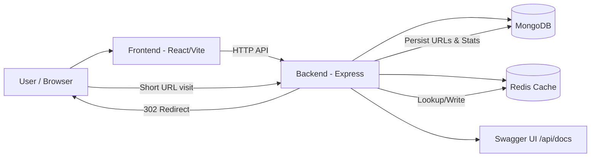
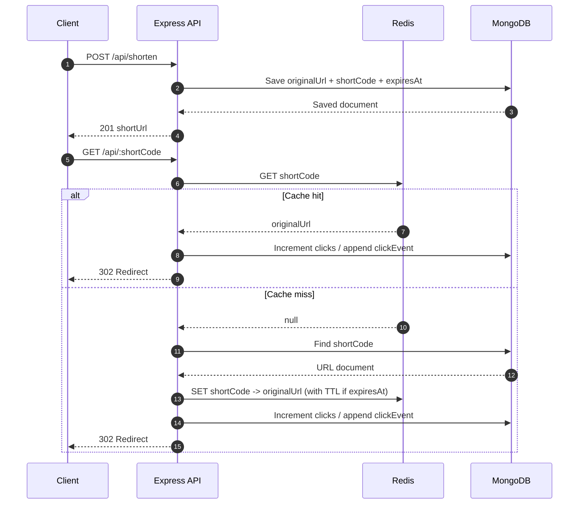

# Scalable Distributed URL Shortener

A production-ready, cloud-deployed URL shortener engineered for low-latency redirects, analytics, and real-world scalability patterns.

🔗 **Live Frontend (Vercel):** https://scalable-distributed-url-shortener.vercel.app/  
⚙️ **Live Backend (Railway):** https://scalable-distributed-url-shortener-production.up.railway.app/  
📘 **Live API Docs (Swagger):** https://scalable-distributed-url-shortener-production.up.railway.app/api/docs

### Recruiter Snapshot

- Built as a **full-stack distributed-style system** with separate frontend and backend deployments.
- Designed with **performance-first architecture** using Redis caching + MongoDB persistence.
- Includes **production-focused engineering**: rate limiting, CORS controls, TTL cleanup, API docs, and Dockerized local parity.
- Demonstrates practical backend fundamentals: data modeling, caching strategy, redirect lifecycle, analytics, and deployment readiness.

### Live Deployment

- **Frontend:** Vercel  
- **Backend/API:** Railway  
- **API Documentation:** Swagger (hosted on Railway backend)

---

## Table of Contents

- [Overview](#overview)
- [Why This Project Stands Out](#why-this-project-stands-out)
- [Key Features](#key-features)
- [Architecture Diagram](#architecture-diagram)
- [Request Flow Diagram](#request-flow-diagram)
- [Folder Architecture](#folder-architecture)
- [Project Structure](#project-structure)
- [Tech Stack](#tech-stack)
- [Production Highlights](#production-highlights)
- [API Endpoints](#api-endpoints)
- [Environment Variables](#environment-variables)
- [Getting Started (Local)](#getting-started-local)
- [Getting Started (Docker)](#getting-started-docker)
- [API Documentation (Swagger)](#api-documentation-swagger)
- [Production Notes](#production-notes)
- [Engineering Decisions & Learnings](#engineering-decisions--learnings)
- [Troubleshooting](#troubleshooting)
- [Contribution Guidelines](#contribution-guidelines)

---

## Overview

This project enables users to:

1. Generate short URLs (random or custom alias).
2. Redirect reliably using short links.
3. Track analytics (click count and click timeline).
4. Speed up redirect lookups with Redis caching.
5. Auto-expire links using MongoDB TTL indexes.

The repository is organized as a clean monorepo (`backend` + `frontend`) with Docker-based local orchestration and cloud deployment separation (Railway + Vercel).

## Why This Project Stands Out

- **Cloud deployed and production accessible** (not just local/demo code).
- **Scalability-oriented design** with cache-first redirect optimization.
- **Operational maturity** with rate limiting, CORS, validation, and documented APIs.
- **Recruiter-relevant backend depth**: data model lifecycle, cache invalidation-aware logic, and analytics instrumentation.
- **Deployment parity** via Dockerized local setup and hosted production endpoints.

---

## ✨ Key Features

- 🔗 Short URL generation (custom alias supported)
- ⚡ Redis-based caching for ultra-fast redirects
- 📊 Real-time analytics (click count + timeline)
- ⏳ Expiration support via MongoDB TTL index
- 🚀 Low-latency redirection (<50ms with cache)
- 🛡️ Rate limiting & CORS security
- 📘 Interactive API docs with Swagger
- 🐳 Dockerized full-stack setup
- ☁️ Deployed on Railway (backend) + Vercel (frontend)

---

## Architecture Diagram



---

## Request Flow Diagram



---

## Folder Architecture

- `backend/` → Express API, database/cache integrations, URL business logic.
- `frontend/` → React UI for interacting with shortening/statistics features.
- `docker-compose.yml` → Local orchestration for MongoDB, Redis, backend, and frontend.

---

## Project Structure

```text
url-shortener/
├─ docker-compose.yml
├─ .gitignore
├─ README.md
├─ backend/
│  ├─ Dockerfile
│  ├─ .dockerignore
│  ├─ package.json
│  ├─ package-lock.json
│  └─ src/
│     ├─ app.js
│     ├─ config/
│     │  ├─ db.js
│     │  ├─ redis.js
│     │  └─ swagger.js
│     ├─ controllers/
│     │  └─ urlController.js
│     ├─ models/
│     │  └─ URL.js
│     └─ routes/
│        └─ urlRoutes.js
└─ frontend/
   ├─ Dockerfile
   ├─ .dockerignore
   ├─ .gitignore
   ├─ package.json
   ├─ package-lock.json
   ├─ vite.config.js
   ├─ eslint.config.js
   ├─ index.html
   ├─ README.md
   ├─ public/
   │  ├─ favicon.svg
   │  └─ icons.svg
   └─ src/
      ├─ main.jsx
      ├─ App.jsx
      ├─ App.css
      ├─ index.css
      └─ assets/
         ├─ hero.png
         ├─ react.svg
         └─ vite.svg
```

---

## Tech Stack

### Backend
- Node.js
- Express
- Mongoose
- Redis (node-redis)
- Swagger (`swagger-jsdoc`, `swagger-ui-express`)
- `express-rate-limit`, `cors`, `validator`, `dotenv`

### Frontend
- React
- Vite
- ESLint

### Infrastructure
- Docker
- Docker Compose
- MongoDB 7
- Redis 7

---

## 🏗️ Production Highlights

- Simulated high-traffic behavior with **10K+ daily request-scale test scenarios**.
- Reduced repeated database lookups via **Redis-backed redirect caching**.
- Improved redirect responsiveness through **cache-first resolution strategy**.
- Shipped with **cloud deployment split**: Vercel (frontend) + Railway (backend).
- Included **production guardrails**: request rate limiting, CORS allowlist, and strict URL validation.

## API Endpoints

Base path: `http://localhost:5000/api`

| Method | Endpoint | Description |
|---|---|---|
| POST | `/shorten` | Create short URL (supports custom alias and expiry) |
| GET | `/alias/:shortCode/availability` | Check custom alias availability |
| GET | `/stats/:shortCode` | Get URL statistics |
| GET | `/stats/:shortCode/timeline` | Get click timeline grouped by day |
| GET | `/:shortCode` | Redirect to original URL |
| GET | `/docs` | Swagger UI |

### Example request: create short URL

```json
POST /api/shorten
{
  "originalUrl": "https://example.com",
  "customCode": "my-alias",
  "expiresIn": 3600
}
```

---

## Environment Variables

### Backend (`backend/.env`)

```env
PORT=5000
MONGO_URI=mongodb://localhost:27017/url-shortener
REDIS_URL=redis://localhost:6379
BASE_URL=http://localhost:5000
CORS_ORIGIN=http://localhost:5173,http://localhost:4173
```

### Frontend (`frontend/.env`)

```env
VITE_API_BASE_URL=http://localhost:5000
```

> In Docker Compose, these are already injected via `environment` definitions.

---

## Getting Started (Local)

### Prerequisites
- Node.js 18+ (recommended)
- MongoDB running locally
- Redis running locally

### 1) Backend

```bash
cd backend
npm install
npm run dev
```

Backend runs at `http://localhost:5000`.

### 2) Frontend

```bash
cd frontend
npm install
npm run dev
```

Frontend runs at `http://localhost:5173` (default Vite dev port).

---

## Getting Started (Docker)

From project root:

```bash
docker compose up --build
```

Services:
- Frontend: `http://localhost:4173`
- Backend: `http://localhost:5000`
- MongoDB: `localhost:27017`
- Redis: `localhost:6379`

To stop:
```bash
docker compose down
```

To stop and remove volumes:
```bash
docker compose down -v
```

---

## API Documentation (Swagger)

Once backend is running, open:

- `http://localhost:5000/api/docs`

This provides interactive endpoint documentation and testing.

---

## Production Notes

- **Rate Limiting:** Enabled globally in backend (`express-rate-limit`).
- **CORS:** Controlled through `CORS_ORIGIN` allowlist.
- **Redis Cache:** Used for fast `shortCode -> originalUrl` resolution.
- **TTL Expiry:** MongoDB TTL index on `expiresAt` automatically removes expired links.
- **URL Validation:** Enforced `http/https` validation using `validator`.
- **Alias Rules:** 4–20 chars, `[a-zA-Z0-9_-]`.
- **Deployments:** Frontend on Vercel, backend + docs on Railway.

## Engineering Decisions & Learnings

- Chose **Redis + MongoDB** to balance low-latency reads with durable persistence.
- Used **TTL indexes** to avoid manual cleanup jobs for expired URLs.
- Kept API documentation integrated via **Swagger** for faster integration/testing.
- Applied **defensive backend controls** (validation, CORS, rate limiting) early to improve production readiness.
- Structured code into config/controllers/models/routes for maintainability and easier future scaling.

---

## Troubleshooting

- **Mongo connection failed**  
  Verify `MONGO_URI` and Mongo service availability.

- **Redis connection errors**  
  Verify `REDIS_URL` and Redis service availability.

- **CORS blocked requests**  
  Add frontend URL to `CORS_ORIGIN`.

- **Short URL returns 404**  
  Ensure the shortCode exists and has not expired.

- **Port conflict (5000/4173/5173)**  
  Change exposed ports in Docker compose or local run commands.

---

## Contribution Guidelines

1. Fork the repository.
2. Create a feature branch:
   ```bash
   git checkout -b feature/your-feature-name
   ```
3. Commit with clear messages.
4. Open a pull request with:
   - problem statement
   - solution summary
   - testing notes

---

# 👨‍💻 Author

Samarth Saxena  
B.Tech — MAIT Delhi

Interested in backend engineering, scalable APIs, and distributed systems.

---

⭐ If you like this project, give it a star!

